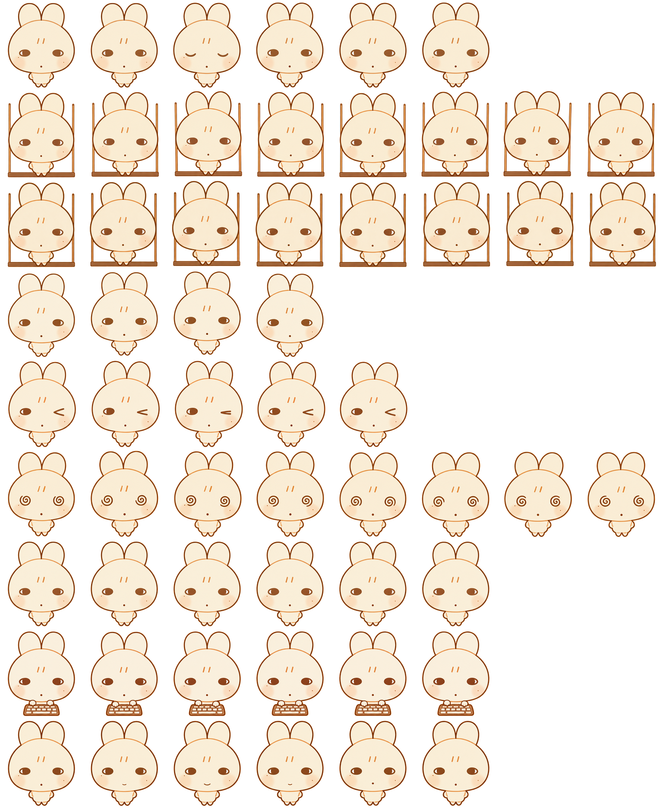

<p align="center">
  
</p>

<h1 align="center">三好兔 · Sanhao Rabbit</h1>

<p align="center">
  一只喜欢跳舞、发呆和窝在小家里陪伴你的三好兔～ᕱ⑅ᕱ ♡
</p>

<p align="center">
  <code>Codex Desktop</code> · <code>Sprite v1</code> · <code>8 × 9</code> · <code>1536 × 1872</code>
</p>

三好兔是一个可以直接安装到 Codex Desktop 的自定义动画宠物。仓库里有完整图集、动作预览，以及 macOS、Linux 和 Windows 安装脚本。

## 把三好兔带回家

最方便的方式是前往 [Releases](https://github.com/hikovo/sanhao-tu/releases)，下载最新版 ZIP 并解压。

<p align="center">
  
</p>

### macOS / Linux

```bash
chmod +x ./install.sh
./install.sh
```

### Windows PowerShell

```powershell
powershell -ExecutionPolicy Bypass -File .\install.ps1
```

安装脚本会把 `pet.json` 和 `spritesheet.webp` 放到：

```text
$CODEX_HOME/pets/sanhao-tu/
```

如果没有设置 `CODEX_HOME`，则使用：

- macOS / Linux：`~/.codex/pets/sanhao-tu/`
- Windows：`%USERPROFILE%\.codex\pets\sanhao-tu\`

安装完成后，重新启动 Codex，或在宠物选择器中重新选择“三好兔”。已有同名宠物时，安装脚本只替换它的 `pet.json` 和 `spritesheet.webp`。

## 动画映射

下面列出了图集每一行在 Codex 中的状态和帧数。GIF 用来预览动作，安装时使用 `spritesheet.webp`。

| Row | 动画预览 | 动作名 | Codex 状态 | 帧数 |
| ---: | :---: | --- | --- | ---: |
| 0 |  | `blink` / 眨眼 | `idle` | 6 |
| 1 |  | `swing-right` / 右秋千 | `running-right` | 8 |
| 2 |  | `swing-left` / 左秋千 | `running-left` | 8 |
| 3 |  | `hop` / 轻跳 | `waving` | 4 |
| 4 |  | `wink` / 眨眼回应 | `jumping` | 5 |
| 5 |  | `dizzy` / 晕眩 | `failed` | 8 |
| 6 |  | `wait` / 等待 | `waiting` | 6 |
| 7 |  | `typing` / 打字 | `running` | 6 |
| 8 |  | `smile` / 微笑 | `review` | 6 |

## 图集信息

- Codex 精灵版本：v1
- 图集：`1536 × 1872 px`
- 网格：8 列 × 9 行
- 单格：`192 × 208 px`
- 格式：lossless RGBA WebP
- 帧数：`6/8/8/4/5/8/6/6/6`

更多细节见 [动画说明](./docs/animations.md)。

<details>
  <summary>查看完整精灵图</summary>
  <p align="center">
    
  </p>
</details>

## 分享素材

`promo/` 中有 9 张 `1:1` 高清 GIF，包括安装教程和 8 组动作展示，可以直接用于分享。

## 手动安装

如果不运行脚本，只需创建宠物目录，并复制两个运行文件：

```text
sanhao-tu/
├── pet.json
└── spritesheet.webp
```

目标位置为 `$CODEX_HOME/pets/sanhao-tu/`；未设置 `CODEX_HOME` 时使用用户目录下的 `.codex/pets/sanhao-tu/`。

## 版本

当前版本：`v1.0.1`。更新内容见 [CHANGELOG](./CHANGELOG.md)。

---

<p align="center">🐰在你敲击键盘时兔兔认真作伴，在你停下的间隙悄悄转转眼珠🐰</p>
